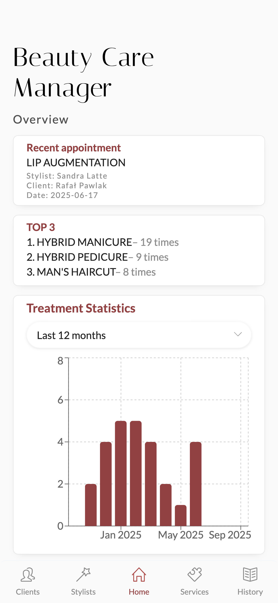
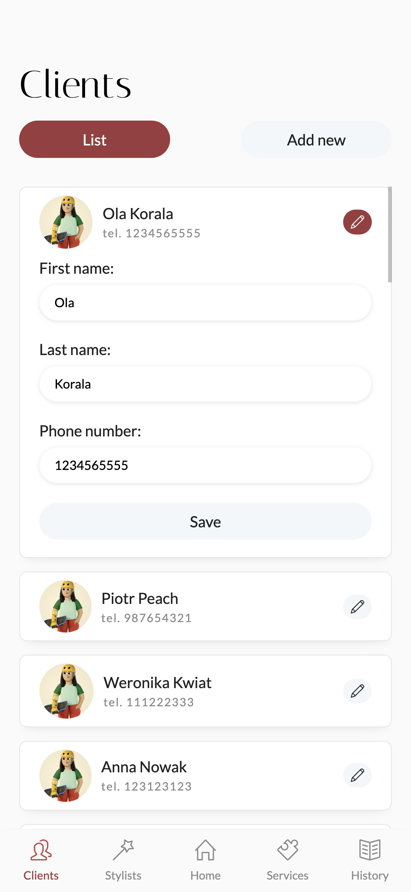
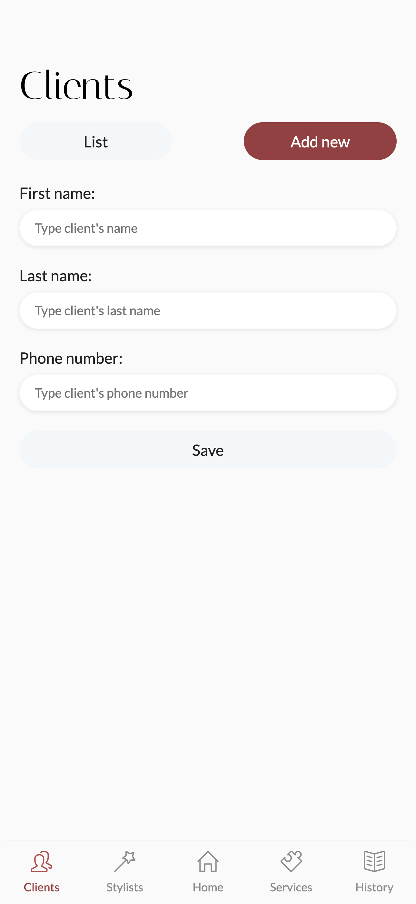
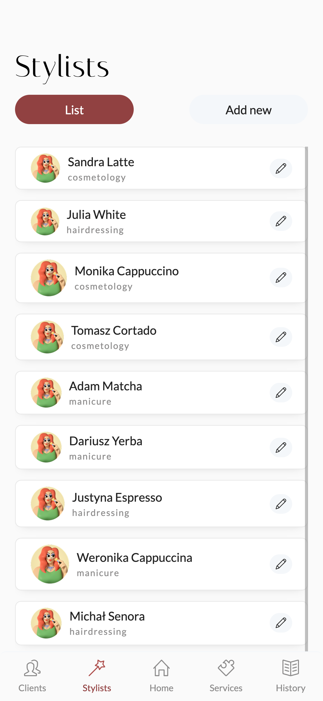
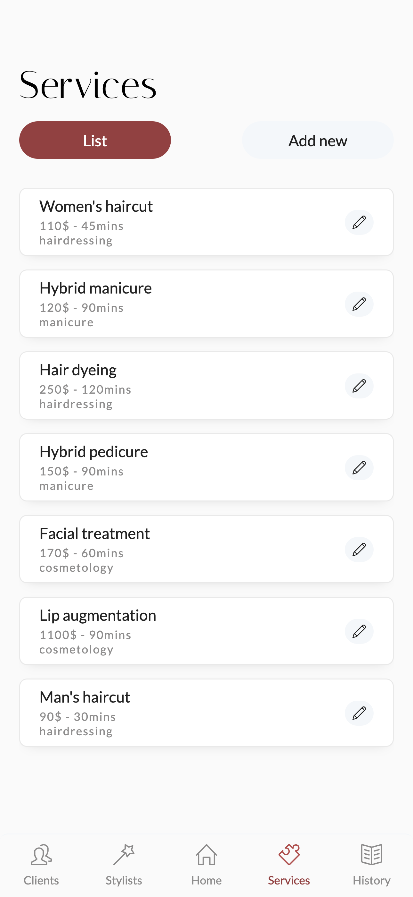
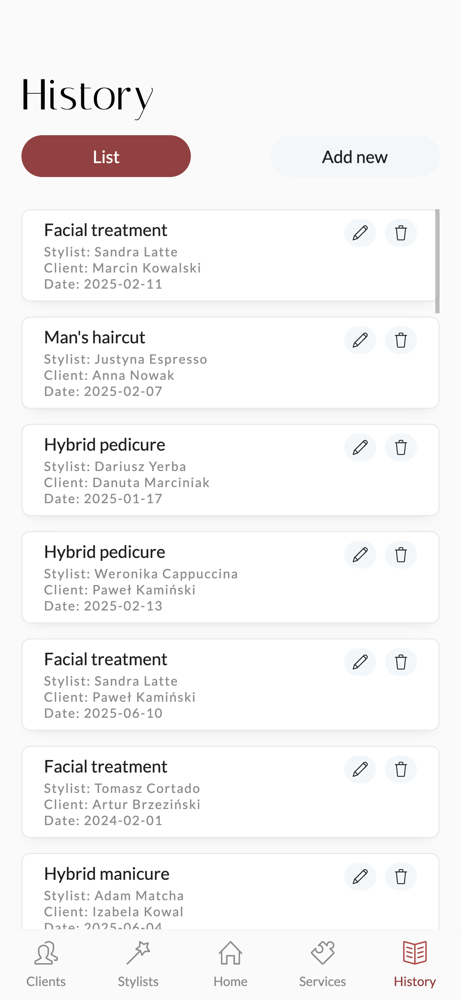

# BeautyCare Management App

**BeautyCare Management App** is a management system for handling clients, stylists, services, and treatments in a beauty salon. It also provides statistics about recently performed treatments, top services, and monthly trends.

## 📸 Screenshots

| Statistics | Clients | Add New Client |
|-----------|---------|----------------|
|  |  |  |


| Stylists | Treatment Types | Treatments |
|----------|-----------------|------------|
|  |  |  |


## ✅ Features

**Database Management**:
- **Clients** – list of clients, ability to add and edit data.
- **Stylists** – list of stylists, ability to add and edit data.
- **Services** – list of services, ability to add and edit data.
- **Treatments** – list of treatments, ability to add and edit (with validation of the assignment of the appropriate specialist for a given service), and delete with confirmation.

**Statistics**:
- Most recently performed procedure.
- Top 3 most frequently performed services.
- Chart showing the number of procedures per month.

**Form Validation** – checks the correctness of entered data.

**Styling**:
- `styled-components` – responsive and aesthetically pleasing design.

**Data Handling**:
- `react-query` – manages state and query caching.
- `fetch API` – retrieves data.
- `json-server` – database (mock API).

## 🛠 Technologies

- **React** (with Vite) – fast rendering and modern build.
- **React Router** – navigation and tab support.
- **React Query** – optimal HTTP query management.
- **styled-components** – CSS-in-JS.
- **json-server** – mock API with a local database.

## 📂 Database Structure (`db.json`)

```json
{
  "clients": [
    {
      "id": 1,
     "firstName": "Ola",
      "lastName": "Korala",
      "phone": "1234565555"
    }
  ],
  "stylists": [
    {
      "id": 1,
      "firstName": "Sandra",
      "lastName": "Latte",
      "specialty": "cosmetology",
    }
  ],
  "treatmentTypes": [
    {
      "id": 1,
      "name": "Women's haircut",
      "duration": "45",
      "price": "110",
      "specialty": "hairdressing",
    }
  ],
  "treatments": [
    {
      "id": "7c34b6",
      "treatmentTypeId": "5e36",
      "date": "2025-02-07",
      "stylistId": "7",
      "clientId": "3"
    }
  ]
}
```

## ▶️ Getting Started

1. **Clone the repository**:

   ```bash
   git clone https://github.com/vokx7/beautycare-management-app.git
   cd beautycare-management-app
   ```

2. **Install dependencies**:

   ```bash
   npm install
   ```

3. **Start json-server**:

   ```
   npx json-server --watch db.json --port 3001
   ```

4. **Run the React app**:

   ```
   npm run dev
   ```
